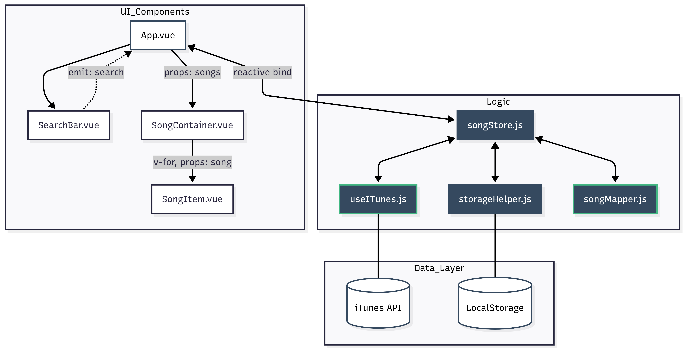
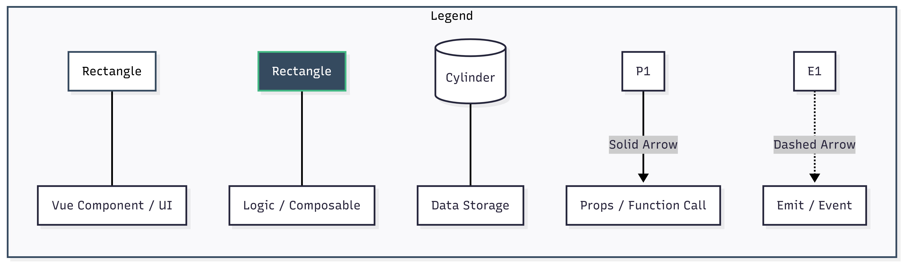

# eMusic

Développé par David Galindo (SI-CA2a) avec [Vue 3](https://vuejs.org/) et [Vite](https://vitejs.dev/).
## Démarrage de l'app
1. Avoir installé [Node.js](https://nodejs.org/fr)
2. Cloner localement le repository git dans un repertoire appelé "emusic-app"
```bash
git clone [https://github.com/davidgalindo-git/TPI_David_Galindo_2026](https://github.com/davidgalindo-git/eSample.git)
```
3. Installer les dépendances
```bash
cd emusic-app
```
```bash
npm install
```
4. Créer un fichier ".env" au même niveau que "package.json" basé sur le fichier ".env.example" et remplacer les données secrètes.  
Création du fichier
```bash
touch .env
```
5. Lancer le projet

Dev (développement)
```bash
npm run dev
```
Build (production)
```bash
npm run build
```

## Tests
Exécuter les tests du dossier src/tests  
Mode Standard (Console)
```bash
npm run test
```
Mode Interface Graphique (UI)  
```bash
npm run test:ui
```
Rapport de Couverture (Coverage)  
```bash
npm run test:coverage
```

### Architecture & Data Flow

